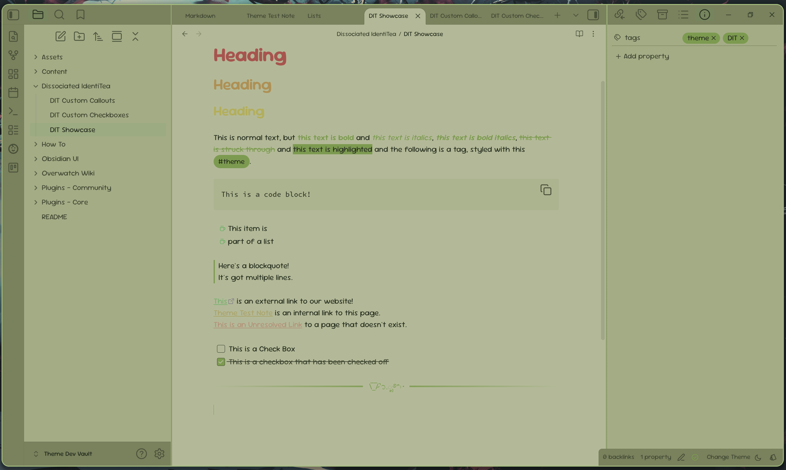
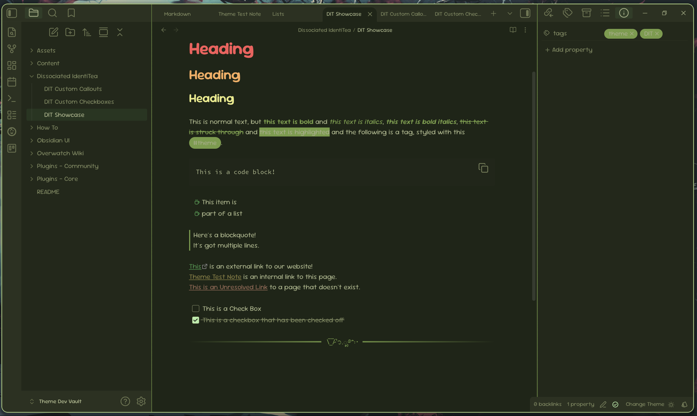
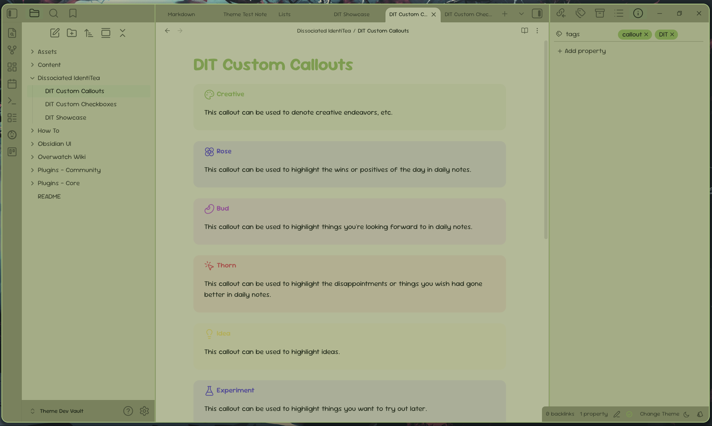
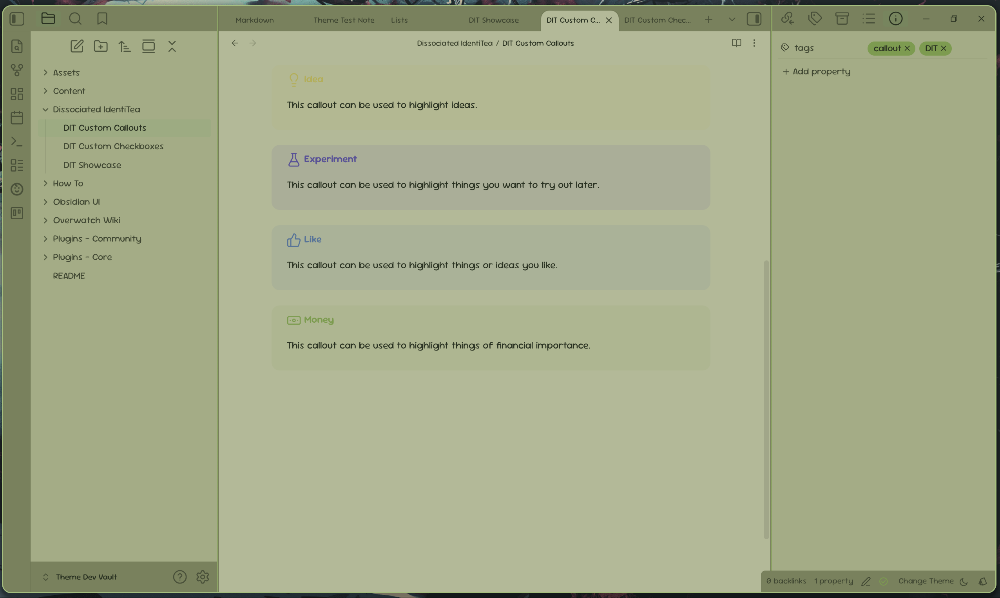
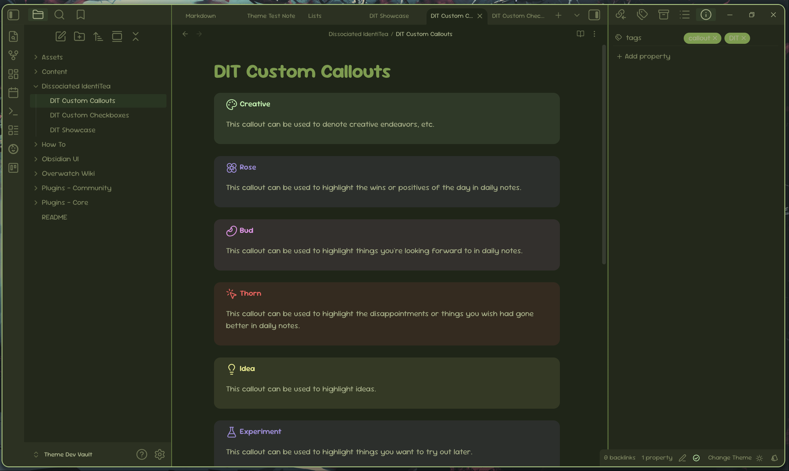
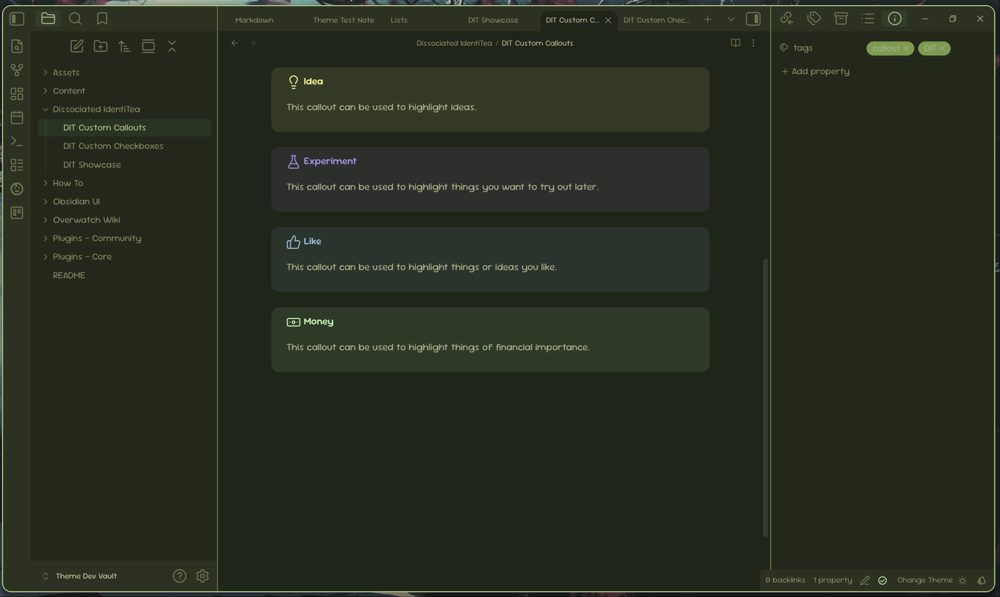
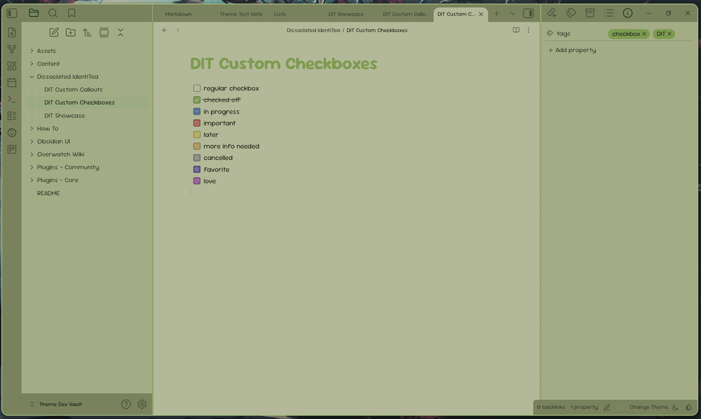
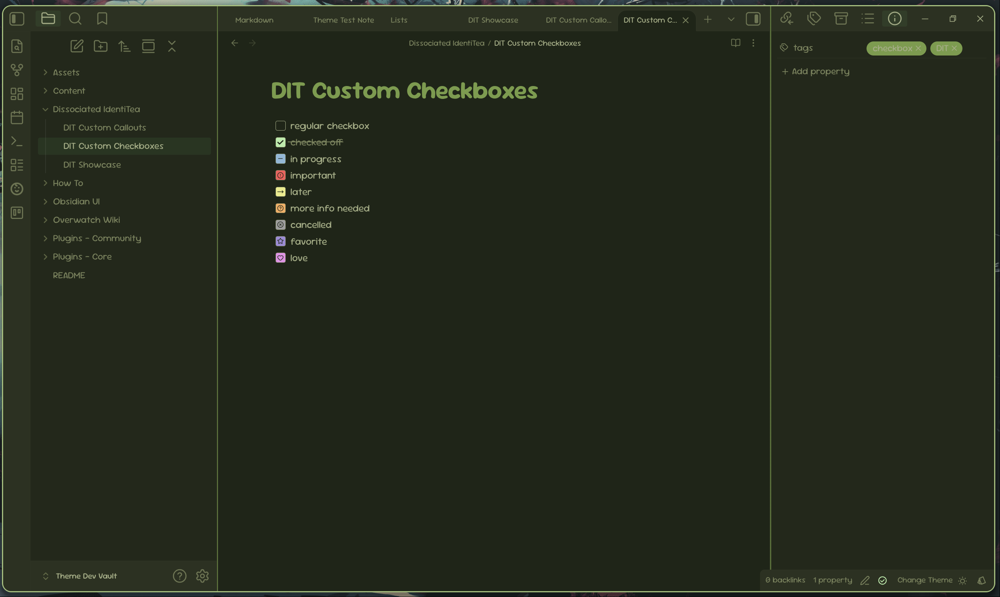

# Dissociated IdentiTea
An altered thinking space theme for [Obsidian](https://obsidian.md)

## Introduction
Based around the fact that I can never seem to choose one coherant idea for a theme, I created **Dissociated IdentiTea** so I wouldn't have to. DIT is still in its very beginning stages, but I plan for it to have multiple subthemes with just enough customization options. Come take a journey into my crazy mind with me!

## Showcase
### Overview
 
> Overview screenshots for the base light and dark modes

DIT has many unique features to discover and extremely customizable colors through [Style Settings](https://github.com/obsidian-community/obsidian-style-settings). You can change the colors of the rainbow to suit your needs, or use the pre-defined ones. Pictured here are the default rainbow colors with an Obsidian color accent of #7C9B4F.

### Custom Callouts
 
> Light mode screenshots of custom callouts

 
> Dark mode screenshots of custom callouts

DIT features several different types of custom callouts that you can use in your daily notes, or wherever you want! These callouts even include a "Creative" callout, where you can denote creative endeavours you wish to undertake, or just something that needs a creative touch.

### Custom Checkboxes
 
> Light and dark mode screenshots of custom checkboxes

DIT features several custom checkboxes for you to use however your heart desires! These include: in progress, important, later, more info needed, cancelled, favorite, and love.

### Subthemes
DIT features a handful of subthemes to suit my (and your!) ever-changing desires. Each subtheme is almost like it's own unique person. Explore them and see which you like best!
> Subthemes coming soon.

## 